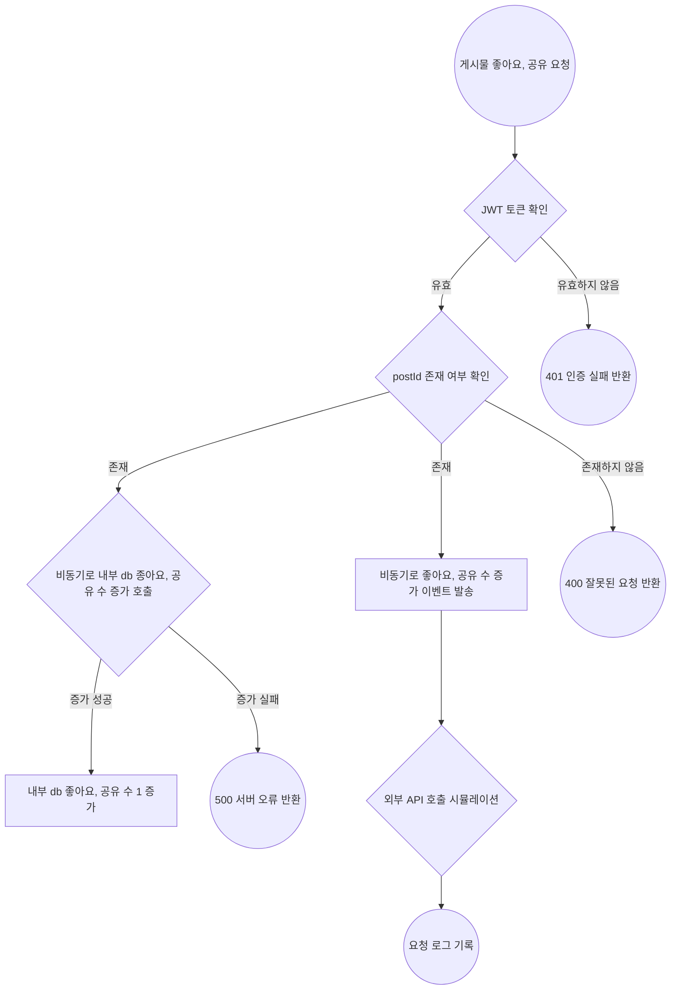
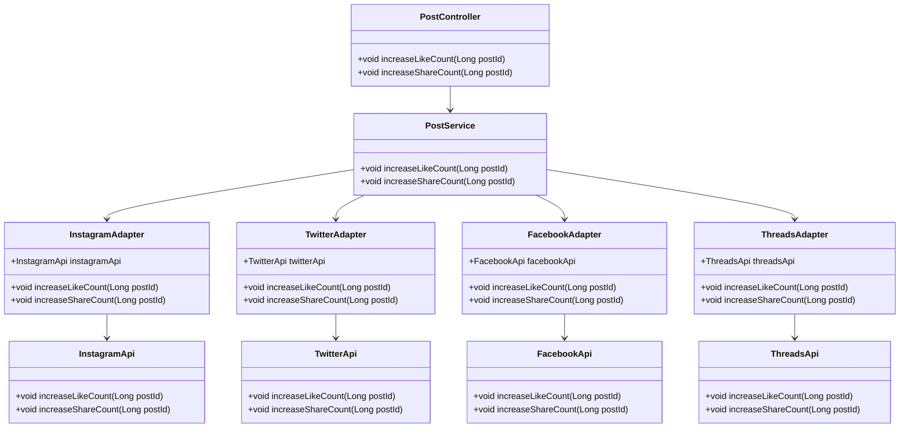
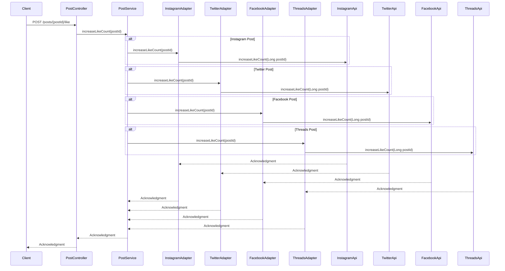
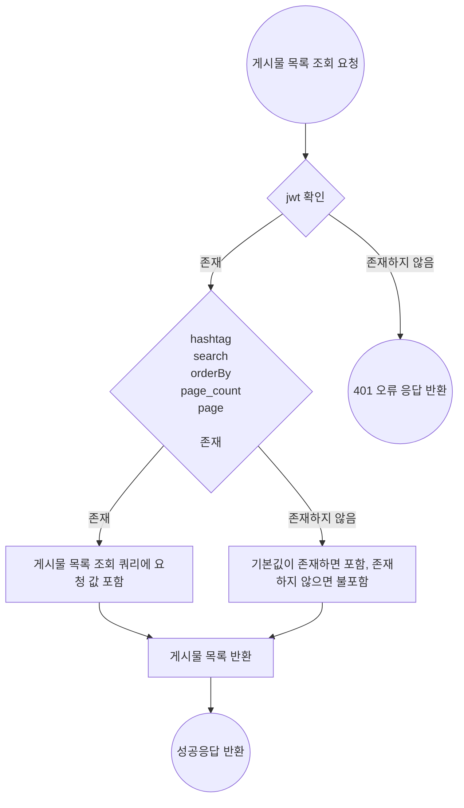
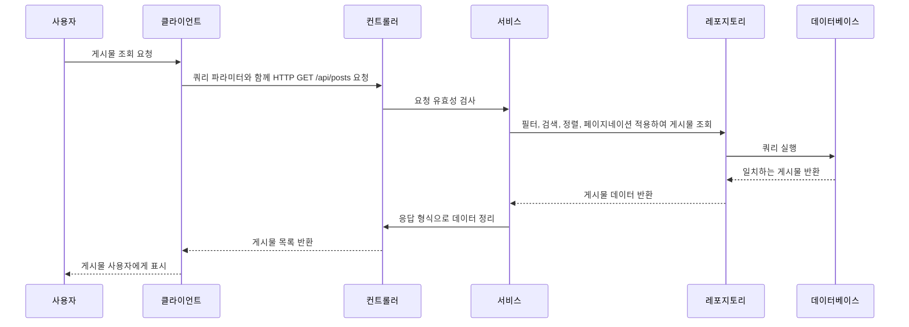
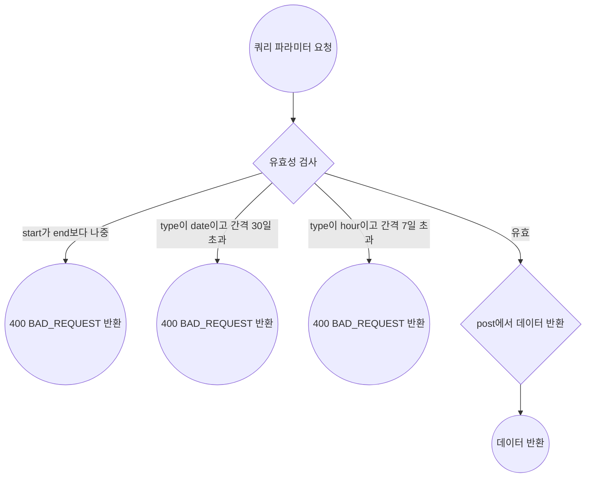
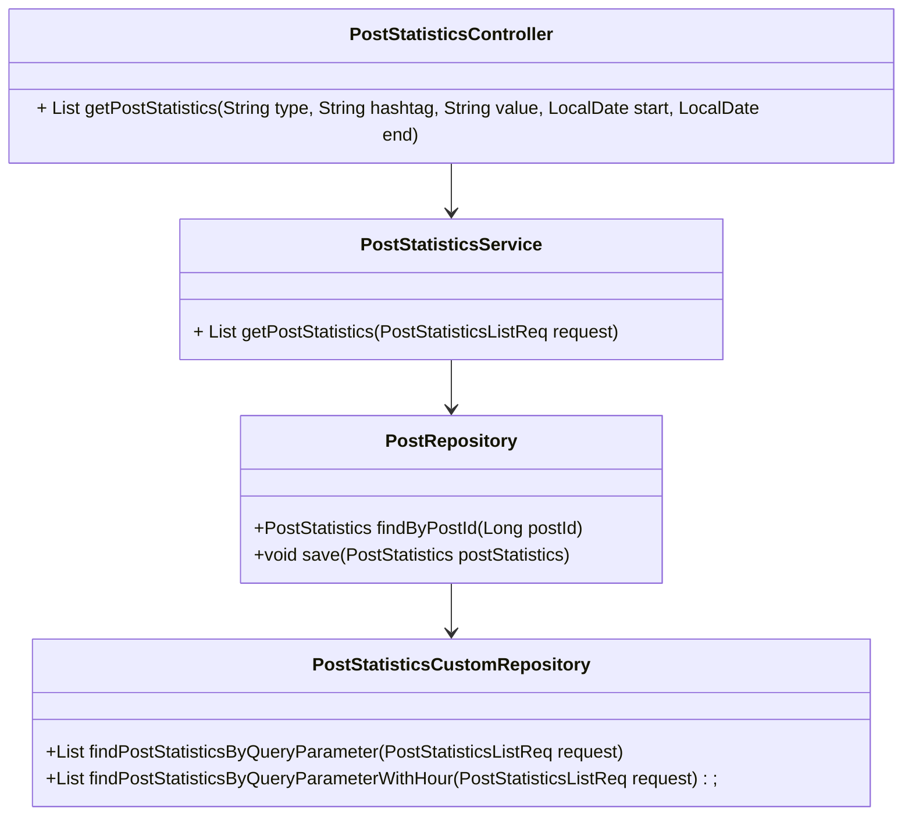

# integrated-feed-backend
소셜 미디어 통합 Feed 서비스


## 개요

다양한 소셜 미디어 플랫폼을 통해 수많은 정보를 접할 수 있게 되었지만 여러 SNS 상에서 산발적으로 게시되는 컨텐츠를 모두 놓치지 않고 확인하기는 쉽지 않습니다. 예를 들어 어떤 주제나 브랜드와 관련해 모니터링하고 싶은 경우, 여러 플랫폼에서 따로따로 관리하는 것은 굉장히 번거로운 일입니다.

`소셜 미디어 통합 Feed 서비스`는 이러한 문제를 해결하기 위한 서비스로, `유저 계정` 또는 브랜드의 `#해시태그`를 기반으로 , , ,  등 다양한 SNS에 게시된 관련 컨텐츠를 한 곳에서 모아볼 수 있는 소셜 미디어 통합 Feed 어플리케이션입니다. 유저들은 자신이 관심 있는 주제나 브랜드의 SNS 노출 현황과 통계를 한눈에 확인할 수 있습니다.

<br/>

## 요구사항 정리 및 기술 명세서

<details>
	<summary> 게시물 “좋아요수”, “공유수” 증가 API</summary>
        
### **요약 (Summary)**

해당 서비스에서 `좋아요`, `공유` 버튼을 클릭할 시 각 게시물의 원래 소셜 미디어의 `좋아요` , `공유` 수를 증가시킬 수 있게 합니다. 

### **목표 (Goals)**

- infra 계층에 각 외부서비스들의 클라이언트를 만듭니다.
- 본 서비스의 `좋아요`, `공유` 수를 외부 서비스에 반영시킵니다.
- 각 게시물의 `소셜미디어`에 맞게 외부서비스에서  `좋아요` 및 `공유`를 늘리는 API 엔드포인트를 구현합니다.
- 실제 API 호출을 시뮬레이션하여 외부 API와의 상호 작용을 추상화함으로써 실제 환경으로 전환할 때 변경 사항의 영향을 줄입니다.
- `event` 를 활용하여 타사 API 상호 작용 시뮬레이션을 비동기식으로 처리하여 서비스 내의 '좋아요' 및 '공유'에 대한 업데이트가 기본 애플리케이션 흐름을 차단하지 않고 효율적으로 처리되도록 합니다.

### **목표가 아닌 것 (Non-Goals)**

- 실제 외부 서비스의 API를 직접 호출하는 기능 개발
- 처리 중에 실제 외부 서비스의 응답을 동기적으로 기다리는 기능 개발
- 살제 외부 서비스의 응답을 기반으로 내부 서비스 로직을 처리하는 기능
- `좋아요` 수와 `공유` 수를 저장했다가 한번에 반영하는 것

### **계획 (Plan)**

<details>
	<summary> 플로우 차트</summary>



</details>

<details>
	<summary> 클래스 다이어그램 </summary>



</details>

<details>
	<summary> 시퀀스 다이어그램 </summary>




</details>

### **마일스톤 (Milestones)**

> `~ 8.22(목)`: controller 계층 구현
> 
> `~ 8.23(금)`: infra 계층의 adapter,client 구현
> 
> `~ 8.24(토)`: service 구현, 단위 테스트 작성
> 
> `~ 8.25(일)`: Rollout

</details>


<details>
	<summary> 게시물 목록 API</summary>
        
### **요약 (Summary)**

사용자가 Feed에서 볼 수 있는 게시물 목록을 조회하는 기능을 제공합니다. 다양한 쿼리 파라미터를 지원하여 해시태그, 게시물 유형, 정렬 순서, 검색 키워드 등 사용자가 원하는 방식으로 게시물을 필터링하고 정렬할 수 있게 합니다.

### **목표 (Goals)**

- 유저가 자신의 `account`가 해시태그로 포함된 게시물 목록을 확인할 수 있게 한다.
- 유저가 지정한 한 개 `hashtag` 가 게시물의 해시태그 중 한 개와정확히 일치하는 게시물 목록을 확인할 수 있게 한다.
- 유저가 지정한 소셜 미디어 플랫폼의 게시물 목록을 확인할 수 있게 한다.
- 유저가 오름차순 및 내림차순을 모두 지원하여 `좋아요개수`, `공유 개수`, `조회수`, `생성 날짜`, `업데이트 날짜`와 같은 여러 필드를 기준으로 `오름차순`, `내림차순`으로 정렬된 게시물 목록을 확인할 수 있게 한다.
- 유저가 게시물의 제목과 내용을 검색하여 포함된 게시물 목록을 확인할 수 있게 한다.
  - 내용은 최대 20자까지만 포함되게 한다.

### **목표가 아닌 것 (Non-Goals)**

- 여러 개의 `hashtag` 가 포함된 게시물을 목록을 확인 기능 개발
- 여러 정렬 기준을 동시에 지원하는 기능 개발
- 특정 `hashtag`를 제외한 게시물 목록을 검색하는 기능 개발
- `hashtag`를 포함하거나 유사하지만 정확히 일치하지 않는 게시물을 검색하는 기능 개발

### **계획 (Plan)**

#### 페이지 네이션

- 공통으로 요청을 받을 수 있는 `PaginationQuery` 생성
- 공통으로 응답을 받을 수 있는 `PaginationMetadata` 생성
  - 응답 예시
  ```json
  {
    "hasNext": true,
    "total": 100
  }
  ```

#### QueryDSl을 사용한 조회

- 동적 쿼리 생성을 위해 QueryDSL 사용

#### 테스트

- 단위 테스트 작성
- 리포지토리 테스트 작성

<details>
	<summary> 플로우 차트</summary>



</details>

<details>
	<summary> 시퀀스 다이어그램 </summary>



</details>


### **마일스톤 (Milestones)**

> `~8월 24(목)`: 요구사항 정리 및 문서화, controller, repository 계층 구현, queryDSL 공부
> 
> `~8월 25일(금)`: service 계층 구현 , 테스트 코드 추가
> 
> `~8월 26일(토)`: 코드 리팩토링

</details>

<details>
	<summary>통계 API</summary>

### **요약 (Summary)**

사용자가 지정한 파라미터에 맞는 게시물을 통계를 내어 반환합니다.

사용자는 `type`, `hashtag`, `value`, `start(조회 시작일)`, `end(조회 종료일)`를 지정할 수 있습니다.

### **목표 (Goals)**

- 쿼리 파라미터 사용
    - API에서 제공하는 쿼리 파라미터를 통해 통계 데이터를 요청하고, 유효성을 검사하여 올바른 결과를 반환합니다.
- 유효성 검사
    - `start`와 `end`의 날짜 유효성 확인 및 `type`에 따른 날짜 간격 제한을`(30일, 7일)` 설정합니다.
- 데이터 집계
    - 요청된 기간 내에 게시물의 조회수, 좋아요 수, 공유 수 등을 집계하여 반환하는 기능을 구현합니다.

### **목표가 아닌 것 (Non-Goals)**

- 통계 기능을 위한 테이블은 생성하지 않습니다.

### **계획 (Plan)**

#### QueryDSl을 사용한 조회

- 많은 쿼리 파라미터를 처리할 동적 쿼리 생성을 위해 `QueryDSL` 사용
- `type`이 `date`인 경우와 `hour`인 경우를 나눠서 메소드 작성
- `Expressions.dateTimeTemplate`을 사용하여 날짜 및 시간 반환 타입 변환

#### API 응답 형식
```json
# type이 date / value는 지정되지 않았으므로 count / hashtag는 springboot / star와 end는 지정되지 않았으므로 오늘로부터 7일 전 ~ 오늘
[
    {
      "date": "2024-08-19",
      "countByValue": 3
    },
    {
      "date": "2024-08-20",
      "countByValue": 10
    } # ... "2024-08-26"까지 data 반환
  ]
```
<details>
	<summary> 플로우 차트</summary>



</details>

<details>
	<summary> 클래스 다이어그램 </summary>



</details>

### **마일스톤 (Milestones)**

> `~ 8.22(목)`: 요구 사항 분석, 테크 스펙 작성
> 
> `~ 8.23(금)`: 더미 데이터 생성. api 명세 구상
> 
> `~ 8.24(토)`: `dto`, `controller` 계층 작성
> 
> `~ 8.25(일)`: `service`, `repository`계층 기능 개발
> 
> `~ 8.26(월)`: Rollout
</details>

## ERD


## 프로젝트 진행 및 이슈 관리

- Github Project 칸반보드 활용
- 각 기능별 이슈 작성 후 하위 이슈 추가


<table>
    <tr align="center">
        <td></td>
        <td></td>
</table>

## Authors

<table>
    <tr align="center">
        <td><B>주다애<B></td>
        <td><B>강경원<B></td>
        <td><B>이도은<B></td>
        <td><B>정의진<B></td>
        <td><B>조혜온<B></td>
        <td><B>이예림<B></td>
    </tr>
    <tr align="center">
            <td>
            
            <br>
            <a href="https://github.com/jooda00"><I>jooda00</I></a>
        </td>
            <td>
            
            <br>
            <a href="https://github.com/toughCircle"><I>toughCircle<I></a>
        </td>
        <td>
            
            <br>
            <a href="https://github.com/medoeun"><I>medoeun</I></a>
        </td>
        <td>
            
            <br>
            <a href="https://github.com/uijin-j"><I>uijin-j</I></a>
        </td>
        <td>
          
            <br>
            <a href="https://github.com/hye-on"><I>hye-on</I></a>
        </td>
        <td>
          
            <br>
            <a href="https://github.com/yerim123456"><I>yerim123456</I></a>
        </td>
    </tr>

</table>
