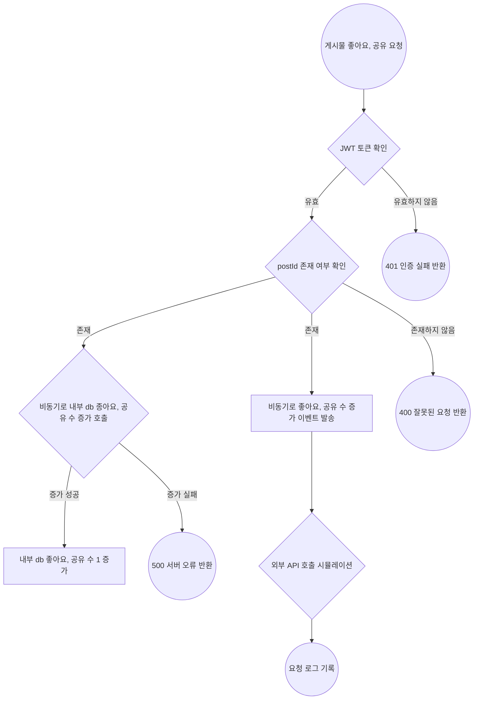
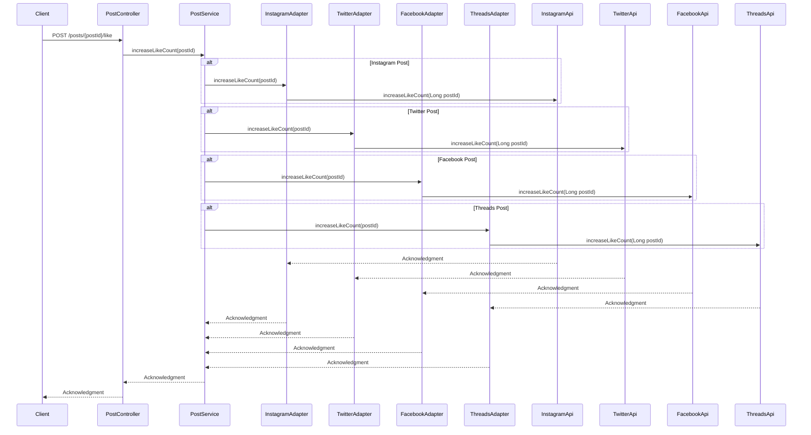

# integrated-feed-backend
소셜 미디어 통합 Feed 서비스

## 요구사항 정리 및 기술 명세서

	
 게시물 “좋아요수”, “공유수” 증가 API

  	

        
### **요약 (Summary)**

해당 서비스에서 `좋아요`, `공유` 버튼을 클릭할 시 각 게시물의 원래 소셜 미디어의 `좋아요` , `공유` 수를 증가시킬 수 있게 합니다. 

### **목표 (Goals)**

- infra 계층에 각 외부서비스들의 클라이언트를 만듭니다.
- 본 서비스의 `좋아요`, `공유` 수를 외부 서비스에 반영시킵니다.
- 각 게시물의 `소셜미디어`에 맞게 외부서비스에서  `좋아요` 및 `공유`를 늘리는 API 엔드포인트를 구현합니다.
- 실제 API 호출을 시뮬레이션하여 외부 API와의 상호 작용을 추상화함으로써 실제 환경으로 전환할 때 변경 사항의 영향을 줄입니다.
- `event` 를 활용하여 타사 API 상호 작용 시뮬레이션을 비동기식으로 처리하여 서비스 내의 '좋아요' 및 '공유'에 대한 업데이트가 기본 애플리케이션 흐름을 차단하지 않고 효율적으로 처리되도록 합니다.

### **목표가 아닌 것 (Non-Goals)**

- 실제 외부 서비스의 API를 직접 호출하는 기능 개발
- 처리 중에 실제 외부 서비스의 응답을 동기적으로 기다리는 기능 개발
- 살제 외부 서비스의 응답을 기반으로 내부 서비스 로직을 처리하는 기능
- `좋아요` 수와 `공유` 수를 저장했다가 한번에 반영하는 것

### **계획 (Plan)**

### 플로우 차트

### 클래스 다이어그램

### 시퀀스 다이어그램

# **마일스톤 (Milestones)**

> `~ 8.22(목)`:  controller 계층 구현  
`~ 8.23(금)`:  infra 계층의 adapter,client 구현  
`~ 8.24(토)`: service 구현, 단위 테스트 작성  
`~ 8.25(일)`: Rollout
>

