# 소셜 미디어 통합 Feed 서비스

   
등 다양한 SNS에 게시된 컨텐츠를 한 곳에 모아 보여주는 서비스

## 목차

- [✨ 개요](#-개요)
- [🧩 Skills](#-skills)
- [Installation](#Installation)
- [💌 API 명세서](#-api-명세서)
- [📄 요구사항 정리 및 기술 명세서](#-요구사항-정리-및-기술-명세서)
- [🏗️ ERD](#%EF%B8%8F-erd)
- [🕝 프로젝트 진행 및 이슈 관리](#-프로젝트-진행-및-이슈-관리)
- [👾 Authors](#-authors)

## ✨ 개요

다양한 소셜 미디어 플랫폼을 통해 수많은 정보를 접할 수 있게 되었지만, 여러 SNS 상에서 산발적으로 게시되는 컨텐츠를 일일이 확인하고 관리하는 건 굉장히 번거로운 일입니다. 어떤 주제나 브랜드에 대해 다양한
사용자 입장에서 모니터링하려면 각 플랫폼을 따로 관리해야 하는 불편함이 있습니다. 이런 문제를 해결할 수 있는 소셜 미디어 통합 Feed 애플리케이션입니다.

`소셜 미디어 통합 Feed 서비스`는 `유저 계정` 또는 브랜드의 `#해시태그`를 기반으로 인스타그램, 쓰레드, 페이스북, 트위터(X) 등 다양한 SNS에 게시된 관련 컨텐츠를 하나의 피드로 통합하여 제공합니다.
이를 통해 관심 있는 주제나 브랜드의 SNS 노출 현황과 통계를 한눈에 쉽게 확인할 수 있습니다.

## 🧩 Skills

</a>
</a>

</a>

</a>
</a>

</a>
</a>
</a>
</a>

</a>
</a>
</a>

## 💌 API 명세서

#### 스웨거 주소

http://15.164.10.5:9020/swagger-ui/index.html#/

## 📄 요구사항 정리 및 기술 명세서

<details>
	<summary> 회원가입 API </summary>

### **요약 (Summary)**

유저는 계정, 비밀번호, 이메일로 가입요청을 진행합니다.  
가입 요청 시, 이메일로 발송된 코드를 입력하여 가입승인을 받고 서비스 이용이 가능합니다.

### **목표 (Goals)**

- `계정` 은 **unique** 합니다.
- `이메일` 은 올바른 이메일 구조인지 **검증**되어야 합니다.
- `비밀번호` 는 아래 중 **2가지 이상의 제약 조건**을 가지며, **암호화**되어 저장됩니다.
    - 제약조건
        - 다른 개인 정보와 유사한 비밀번호는 사용할 수 없습니다.
        - 비밀번호는 최소 10자 이상이어야 합니다.
        - 통상적으로 자주 사용되는 비밀번호는 사용할 수 없습니다.
        - 숫자로만 이루어진 비밀번호는 사용할 수 없습니다.
        - 숫자, 문자, 특수문자 중 2가지 이상을 포함해야 합니다.
        - 이전 비밀번호와 동일하게 설정할 수 없습니다.
        - 3회 이상 연속되는 문자 사용이 불가합니다.
- 위 조건을 만족한 상태에서 가입요청 시, 유저가 생성되고 6자리의 랜덤한 코드가 입력한 이메일로 발송됩니다.
- `계정` , `비밀번호`, `인증코드` 가 올바르게 입력되었을 시 가입승인이 되어 서비스 이용이 가능합니다.

### **목표가 아닌 것 (Non-Goals)**

- 실제 이메일 발송

### **계획 (Plan)**

#### Step 1. 회원가입

<details>
	<summary> 〰️ 플로우 차트 </summary>

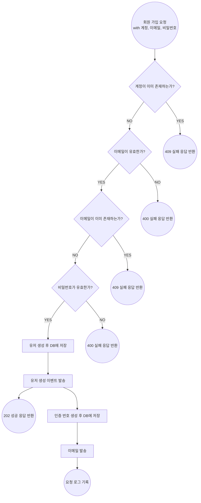

</details>

<details>
	<summary> 💾 회원가입에 필요한 유저(멤버) ERD </summary>

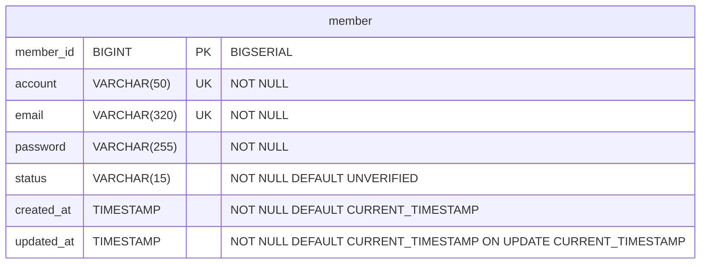

**Account 필드**  
username 길이 제한  
✔ 인스타그램: `30자`  
✔ 쓰레드: `30자` (인스타그램과 같음)  
✔ 트위터: `15자`  
✔ 페이스북: `50자`

**Email 필드**  
이메일 주소는 **최대 320자**입니다. 이 값은 로컬 파트(64자)와 도메인 파트(255자)를 합친 후 “@” 기호를 추가한 것입니다. (by. 챗지피티)

**Password 필드**  
비밀번호는 암호화되어 저장됨으로 고정 길이임. Argon2 알고리즘을 사용하면 일반적으로 **90자 ~ 130자** (by. 챗지피티)

**Status 필드**  
`UNVERIFIED`: 이메일 인증 전 상태  
`VERIFIED`: 이메일 인증 완료 상태

</details>

<details>
	<summary> 🔐 비밀번호 암호화 알고리즘 </summary>  

1️⃣ BCryptPasswordEncoder </br>
✔ 오래전부터 사용된 알고리즘으로, 비밀번호 해시에 대한 가장 일반적인 선택 중 하나
✔ bcrypt는 최대 입력 길이가 72바이트로 제한되기 때문에 긴 비밀번호는 잘릴 수 있음

2️⃣ Argon2PasswordEncoder 🌟 </br>
✔ 비밀번호 해시에 대한 **최신 표준** (2015년 암호 해싱 대회에서 우승)

3️⃣ Pbkdf2PasswordEncoder </br>
✔ FIPS 인증이 필요할 때 좋은 알고리즘
✔ bcrypt나 Argon2보다는 조금 더 느리고, 설정에 따라 매우 높은 보안성을 제공하지 못할 수도 있음

4️⃣ SCryptPasswordEncoder </br>
✔ bcrypt나 Argon2에 비해 설정이 복잡할 수 있으며, 메모리 사용량이 높아 일부 환경에서 부적합

**👩🏻‍⚖️ 결론은 보안 표준이면서, 가장 강력한 보안을 제공하는 Argon2PasswordEncoder를 사용하자!**

</details>

<details>
	<summary> 🧮 이메일 형식 확인을 위한 정규식 </summary>

Hibernate Validator에서 @Email 애너테이션을 사용할 때 기본적으로 적용되는 정규식

```plaintext
^[a-zA-Z0-9._%+-]+@[a-zA-Z0-9.-]+\.[a-zA-Z]{2,6}$
```

</details>

<details>
	<summary> 📋 비밀번호 제약조건 전략 </summary>
<h4> 📌 다른 개인 정보와 유사한 비밀번호는 사용할 수 없습니다. </h4>

🔍 질문 1. 다른 개인 정보에는 뭐가 있을까?
: 보통 사용자 이름, 이메일, 전화번호, 생년월일이 있지만, 현재 서비스에서는 이메일만 존재

🔍 질문 2. 유사한지는 어떻게 판단하지?
: 직접 문자열 비교, 부분 문자열 비교, Levenshtein 거리 알고리즘

🔍 질문 3. Levenshtein 거리 알고리즘이 뭐지?
: 문자열 간의 편집 거리를 계산하는 알고리즘을 사용하여 비밀번호와 개인 정보의 유사성을 판단할 수 있습니다. 이 알고리즘을 사용하면 문자열이 얼마나 유사한지를 수치적으로 계산할 수 있습니다. 편집 거리가 짧으면
비밀번호가 개인 정보와 유사하다고 판단할 수 있습니다. (by. 챗지피티)

💡 tip) 비교 시 대소문자를 무시하고, 공백이나 특수문자를 제거한 후 비교하는 것이 좋음


<h4> 📌 통상적으로 자주 사용되는 비밀번호는 사용할 수 없습니다. </h4>

✔ 자주 사용되는 비밀번호 목록이 필요! (ex. most common password in Korea)  
✔ 목록을 DB에 저장 (변경이 거의 없기 때문에 캐싱 or 파일 시스템 활용 가능)  
✔ 비밀번호 검사 시 사용 (Set 자료구조를 사용할 수 있을 듯)

</details>

<details>
	<summary> 🎰 인증 코드 생성 방식 </summary>

1️⃣ 랜덤한 6자리 숫자 코드  
✔ 숫자만으로 구성된 코드는 사용자가 쉽게 입력할 수 있음  
✔ 브루트포스 공격에 취약 (6자리 숫자 코드는 1,000,000(10^6)가지 경우의 수만 있음)

**🛠️ 구현방법**  
**`java.security.SecureRandom`** 모듈을 사용하면, 보안적으로 안전한 난수를 생성할 수 있음
> ❓ 보안적으로 안전한 난수  
> 일반적인 Random 클래스는 시드(seed)를 기반으로 난수를 생성하지만, SecureRandom은 운영체제에서 제공하는 강력한 난수 생성기를 사용하여 보다 예측 불가능한 난수를 생성합니다.
>

</br>
2️⃣ 랜덤한 6자리 코드 (숫자 + 문자)  
✔ 경우의 수가 급격히 증가 (보안↑)  
✔ 사용자가 입력하기 불편  
✔ ‘1’, ‘I’ 등 사용자들이 혼동할 수 있음

**👩🏻‍⚖️ 결론, 사용성을 위해 숫자만 사용하는 1️⃣번 방식으로 하되, 부르트포스 공격을 막기 위해 처리율을 제한할 수 있음**

</details>

<details>
	<summary> 🎰 인증 코드 저장 방식 </summary>

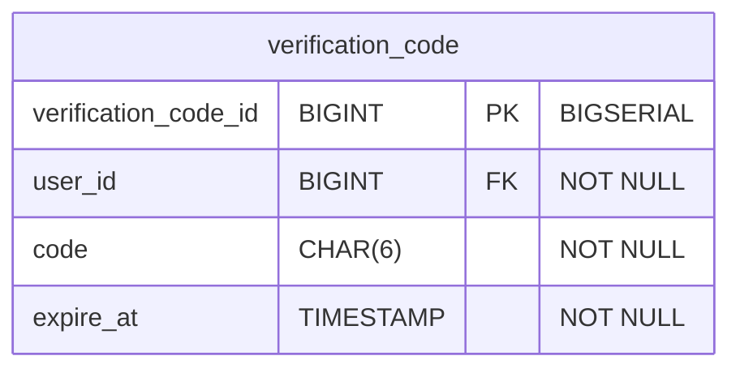

1️⃣ DB에 저장 </br>
✔ 가장 일반적인 방식

🤔 그럼 user 테이블과 합쳐야 할까? 분리해야 할까?  
✔ user 테이블과 합치면, 하나의 트랜잭션으로 모든 작업을 처리할 수 있기 때문에 성능면에서 장점이 있음 👍🏻  
✔ 인증 코드는 일시적인 데이터이기 때문에 인증 번호가 유효하지 않게 되거나 만료된 후에도 계속해서 유저 테이블에 남아 있을 수 있기 때문에 데이터 관리가 어려워짐 👎🏻  
✔ 인증 코드를 위해 만료시간 등 추가적인 데이터가 필요할 수 있는데, 이러한 정보를 모두 user 테이블에 넣게 되면 user 테이블이 불필요하게 커질 수 있음 👎🏻

**👩🏻‍⚖️ 결론은 분리하자!**

2️⃣ 캐시(Redis)에 저장 </br>
**장점**  
✔ 조회 성능 ↑  
✔ TTL 관리가 쉬움

**단점**  
✔ 데이터 휘발 가능성  
💡 데이터가 휘발된 경우 유저에게 재인증 요청  
💡 데이터 영속화 → 캐시

**👩🏻‍⚖️ 결론은 일단 RDB에 저장한 뒤, 성능 개선이 필요하다면 캐시를 활용하자!**

</details>

<details>
	<summary> 📂 클래스 다이어그램 </summary>

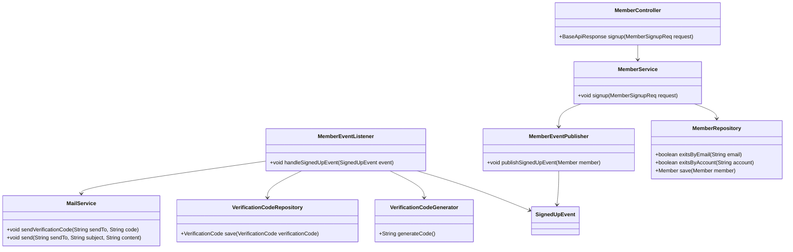

</details>

### **이외 추가 고려 사항들 (Other Considerations)**

🤔 DB에 저장된 인증 코드의 만료 관리  
🤔 가입 승인 요청에 대한 처리율 제한 (ex. 10분 동안 10번 넘게 요청 X)  
🤔 이메일 발송 실패 시 대응

### **마일스톤 (Milestones)**

> ~ 8.21(수): 비밀번호 제약 조건 관련 리서치  
> ~ 8.23(금): 회원가입 기능 구현 및 이메일 발송 관련 리서치  
> ~ 8.25(일): 가입 승인 기능 구현  
> ~ 8.26(월): 코드 리팩토링 및 미진한 내용 보충

</details>

<details>
	<summary> 로그인 API</summary>

### **요약 (Summary)**

유저는 가입한 계정, 비밀번호로 로그인합니다. 서비스 로그인 시 메뉴는 **통합 Feed** 단일 입니다.

### **목표 (Goals)**

- `계정`, `비밀번호` 로 로그인 시 `JWT` 가 발급됩니다.
- **이후 모든 API 요청 Header 에 `JWT` 가 항시 포함되며, `JWT` 유효성을 검증합니다.**
- 서비스 로그인 시, 메뉴는 **통합 Feed** 단일 입니다.

### **목표가 아닌 것 (Non-Goals)**

- JWT 발급받은 후 유저를 통합 Feed 페이지로 프론트엔드 리디렉션 처리
- 계정 잠금, 자동 로그아웃 등 사용자 경험 관련 추가 로직

### 로그인 api 요구사항 상세

- **설명**
    - 사용자는 계정과 비밀번호를 입력하여 로그인할 수 있으며, 로그인 성공 시 JWT 토큰을 발급받습니다. (**Authentication)**
    - 이후 모든 API에서 JWT 토큰을 사용하여 인가 요청을 보낼 수 있습니다. **(Authorization)**
- **입력 데이터**
    - `계정(아이디)`
    - `비밀번호`
- **출력 데이터**
    - `JWT 토큰`
- **처리 과정**:
    1. 사용자가 입력한 계정과 비밀번호를 검증합니다.
    2. 검증이 성공하면 JWT 토큰을 생성합니다.
    3. 생성된 JWT 토큰을 사용자에게 반환합니다.
    4. 사용자는 이후의 API 요청 시 이 JWT 토큰을 헤더에 포함하여 서버에 요청을 보냅니다.
    5. 서버는 각 요청에서 JWT 토큰의 유효성을 검증하여 인가 처리합니다.
- **예외 사항**
    - 입력한 계정(아이디)이나 비밀번호가 잘못된 경우, 오류 메시지와 함께 인증 실패 응답을 반환합니다.
    - 만료된 JWT 토큰으로 요청한 경우, 인증 오류 응답을 반환합니다.
    - JWT 토큰이 없는 경우, 인증되지 않은 상태로 처리하여 오류 응답을 반환합니다.

 </br>

<details>
	<summary> 플로우 차트 </summary>

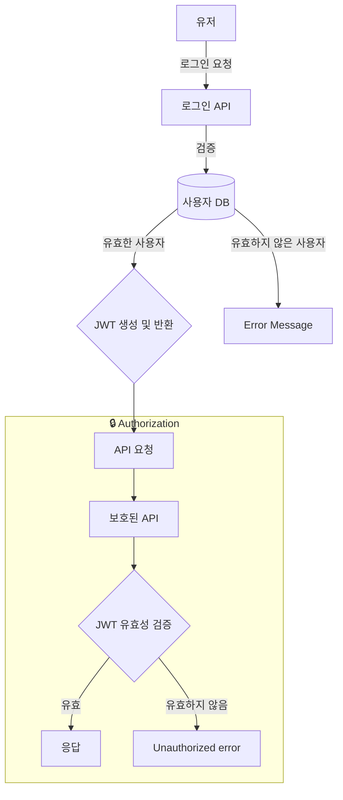

</details>

<details>
	<summary> 유저 ERD </summary>


</details>

### **계획 (Plan)**

- DTO, 서비스, 레파지토리 구현
    - 계정(아이디) 및 비밀번호를 사용한 유저 인증 로직 작성
- JWT 토큰 생성 로직 구현
- **JWT 검증 로직 구현**
    - JWT 검증 필터 설정
        - Spring Security 설정
        - JWT 인증 필터 작성 - 로그인, 회원가입 및 인증 제외 모든 요청이 필터를 통과하도록
    - 기본적인 예외 처리 로직 구현 (유효하지 않은 JWT, 만료된 JWT 등)
- 로그인 컨트롤러 구현
- 테스트 코드 작성 및 기능 테스트
    - JWT, 로그인 API, Spring Security 설정 유닛 테스트
    - 통합 테스트

### **이외 추가 고려 사항들 (Other Considerations)**

- JWT 만료 시간, 비밀키 저장 방법, 만료 전 갱신 등
- 로그인 시도, 실패, 성공, 토큰 만료 등의 이벤트 로깅
- 잘못된 로그인 정보, 만료된 토큰, 권한 부족 등 에러 처리

### **마일스톤 (Milestones)**


</details>

<details>
	<summary> 게시물 상세 조회 API</summary>

### **요약 (Summary)**

게시물 상세 조회 API는 사용자에게 특정 게시물의 상세 정보를 제공하는 기능입니다. 사용자는 이 API를 통해 게시물의 제목, 내용 및 게시물 관련 메타데이터를 조회할 수 있습니다.

### **목표 (Goals)**

- 사용자가 특정 게시물의 모든 세부 정보를 한 번의 API 호출로 가져올 수 있도록 한다.
- 사용자가 요청한 게시물이 존재하지 않는 경우, 적절한 에러 메시지를 반환한다.
- 특정 게시물의 상세 정보 반환에 성공할 경우, 해당 게시물의 view_count를 1 증가시킨다.

### **계획 (Plan)**

<details>
	<summary> 플로우 차트</summary>

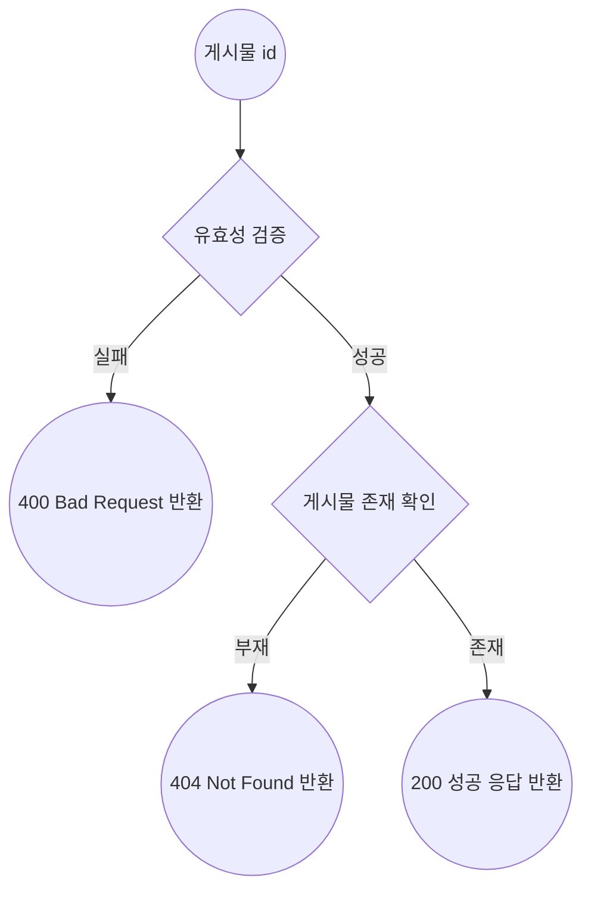

</details>

<details>
	<summary> 시퀀스 다이어그램 </summary>

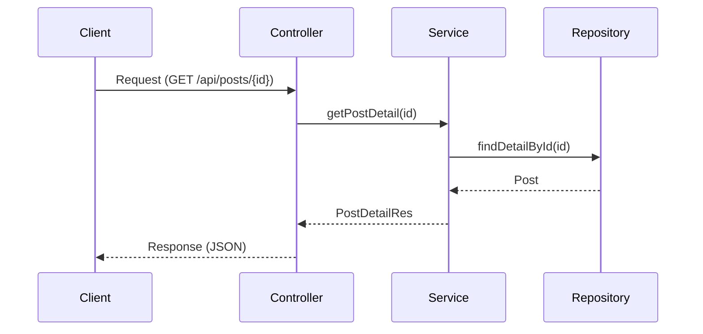

</details>

### **유닛 테스트**

- [성공] 게시물 상세 정보가 정상적으로 반환된다.
- [실패] 게시물이 없을 때 예외를 던진다.
- [성공] 조회된 게시물의 view_count가 1 증가한다.
- [실패] 잘못된 형식의 ID가 제공되면 400 Bad Request가 반환된다.

### **마일스톤 (Milestones)**

> `~ 8.21(수)`: 요구사항 분석
>
> `~ 8.22(목)`: 테크 스펙 작성
>
> `~ 8.23(금)`: 기능 구현 및 단위 테스트 작성
>
> `~ 8.25(일)`: 테스트 수정 및 리드미 작성

</details>


<details>
	<summary> 게시물 “좋아요수”, “공유수” 증가 API</summary>

### **요약 (Summary)**

해당 서비스에서 `좋아요`, `공유` 버튼을 클릭할 시 각 게시물의 원래 소셜 미디어의 `좋아요` , `공유` 수를 증가시킬 수 있게 합니다.

### **목표 (Goals)**

- infra 계층에 각 외부서비스들의 클라이언트를 만듭니다.
- 본 서비스의 `좋아요`, `공유` 수를 외부 서비스에 반영시킵니다.
- 각 게시물의 `소셜미디어`에 맞게 외부서비스에서  `좋아요` 및 `공유`를 늘리는 API 엔드포인트를 구현합니다.
- 실제 API 호출을 시뮬레이션하여 외부 API와의 상호 작용을 추상화함으로써 실제 환경으로 전환할 때 변경 사항의 영향을 줄입니다.
- `event` 를 활용하여 타사 API 상호 작용 시뮬레이션을 비동기식으로 처리하여 서비스 내의 '좋아요' 및 '공유'에 대한 업데이트가 기본 애플리케이션 흐름을 차단하지 않고 효율적으로 처리되도록 합니다.

### **목표가 아닌 것 (Non-Goals)**

- 실제 외부 서비스의 API를 직접 호출하는 기능 개발
- 처리 중에 실제 외부 서비스의 응답을 동기적으로 기다리는 기능 개발
- 살제 외부 서비스의 응답을 기반으로 내부 서비스 로직을 처리하는 기능
- `좋아요` 수와 `공유` 수를 저장했다가 한번에 반영하는 것

### **계획 (Plan)**

<details>
	<summary> 플로우 차트</summary>

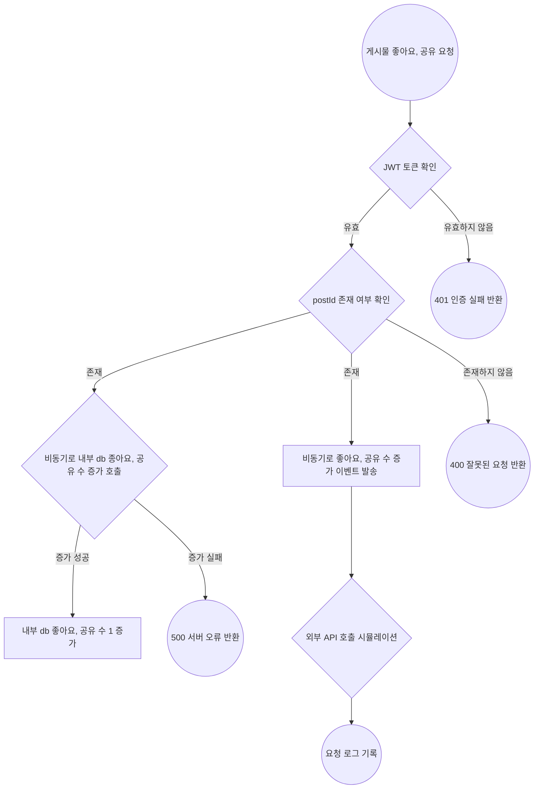

</details>

<details>
	<summary> 클래스 다이어그램 </summary>


</details>

<details>
	<summary> 시퀀스 다이어그램 </summary>

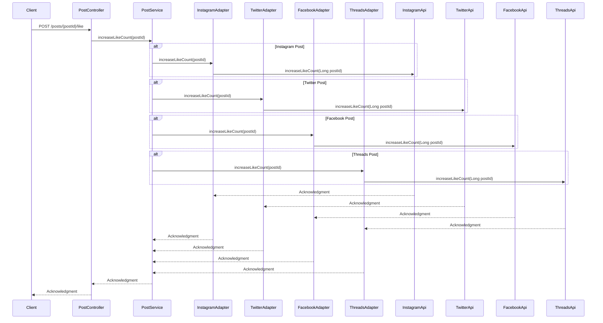

</details>

### **마일스톤 (Milestones)**

> `~ 8.22(목)`: controller 계층 구현
>
> `~ 8.23(금)`: infra 계층의 adapter,client 구현
>
> `~ 8.24(토)`: service 구현, 단위 테스트 작성
>
> `~ 8.25(일)`: Rollout

</details>


<details>
	<summary> 게시물 목록 API</summary>

### **요약 (Summary)**

사용자가 Feed에서 볼 수 있는 게시물 목록을 조회하는 기능을 제공합니다. 다양한 쿼리 파라미터를 지원하여 해시태그, 게시물 유형, 정렬 순서, 검색 키워드 등 사용자가 원하는 방식으로 게시물을 필터링하고 정렬할
수 있게 합니다.

### **목표 (Goals)**

- 유저가 자신의 `account`가 해시태그로 포함된 게시물 목록을 확인할 수 있게 한다.
- 유저가 지정한 한 개 `hashtag` 가 게시물의 해시태그 중 한 개와정확히 일치하는 게시물 목록을 확인할 수 있게 한다.
- 유저가 지정한 소셜 미디어 플랫폼의 게시물 목록을 확인할 수 있게 한다.
- 유저가 오름차순 및 내림차순을 모두 지원하여 `좋아요개수`, `공유 개수`, `조회수`, `생성 날짜`, `업데이트 날짜`와 같은 여러 필드를 기준으로 `오름차순`, `내림차순`으로 정렬된 게시물 목록을 확인할
  수 있게 한다.
- 유저가 게시물의 제목과 내용을 검색하여 포함된 게시물 목록을 확인할 수 있게 한다.
    - 내용은 최대 20자까지만 포함되게 한다.

### **목표가 아닌 것 (Non-Goals)**

- 여러 개의 `hashtag` 가 포함된 게시물을 목록을 확인 기능 개발
- 여러 정렬 기준을 동시에 지원하는 기능 개발
- 특정 `hashtag`를 제외한 게시물 목록을 검색하는 기능 개발
- `hashtag`를 포함하거나 유사하지만 정확히 일치하지 않는 게시물을 검색하는 기능 개발

### **계획 (Plan)**

#### 페이지 네이션

- 공통으로 요청을 받을 수 있는 `PaginationQuery` 생성
- 공통으로 응답을 받을 수 있는 `PaginationMetadata` 생성
    - 응답 예시
  ```json
  {
    "hasNext": true,
    "total": 100
  }
  ```

#### QueryDSl을 사용한 조회

- 동적 쿼리 생성을 위해 QueryDSL 사용

#### 테스트

- 단위 테스트 작성
- 리포지토리 테스트 작성

<details>
	<summary> 플로우 차트</summary>

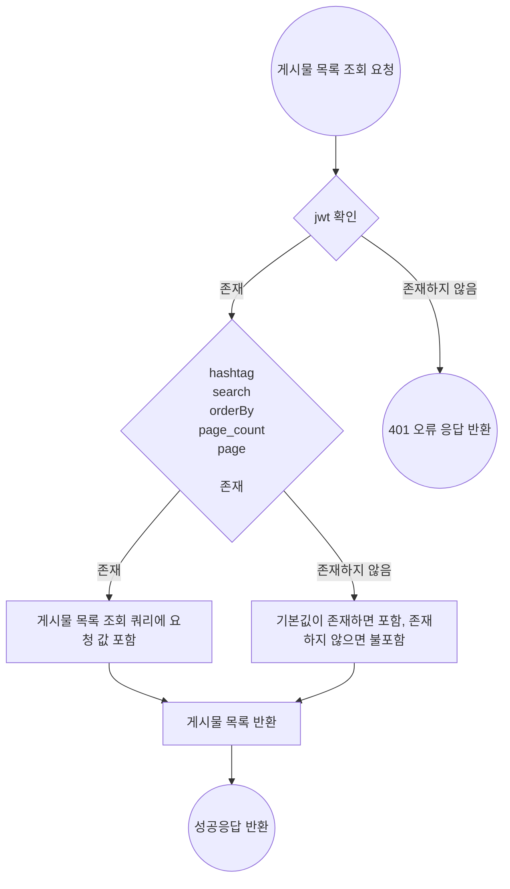

</details>

<details>
	<summary> 시퀀스 다이어그램 </summary>

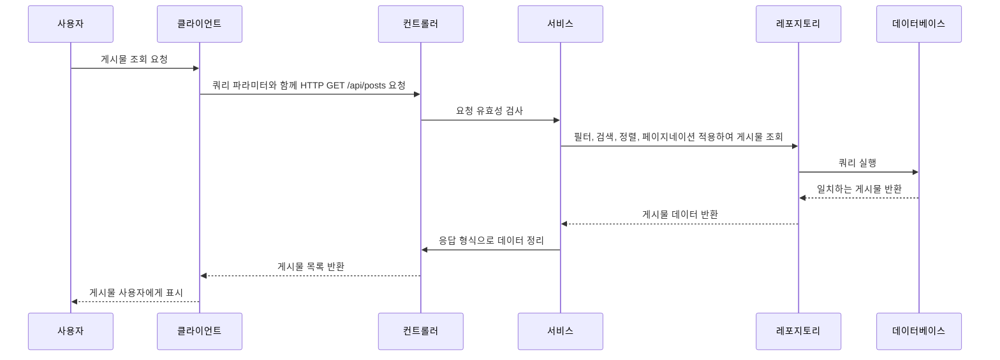

</details>

### **마일스톤 (Milestones)**

> `~ 8.24(목)`: 요구사항 정리 및 문서화, controller, repository 계층 구현, queryDSL 공부
>
> `~ 8.25(금)`: service 계층 구현 , 테스트 코드 추가
>
> `~ 8.26일(토)`: 코드 리팩토링

</details>

<details>
	<summary>통계 API</summary>

### **요약 (Summary)**

사용자가 지정한 파라미터에 맞는 게시물을 통계를 내어 반환합니다.

사용자는 `type`, `hashtag`, `value`, `start(조회 시작일)`, `end(조회 종료일)`를 지정할 수 있습니다.

### **목표 (Goals)**

- 쿼리 파라미터 사용
    - API에서 제공하는 쿼리 파라미터를 통해 통계 데이터를 요청하고, 유효성을 검사하여 올바른 결과를 반환합니다.
- 유효성 검사
    - `start`와 `end`의 날짜 유효성 확인 및 `type`에 따른 날짜 간격 제한을`(30일, 7일)` 설정합니다.
- 데이터 집계
    - 요청된 기간 내에 게시물의 조회수, 좋아요 수, 공유 수 등을 집계하여 반환하는 기능을 구현합니다.

### **목표가 아닌 것 (Non-Goals)**

- 통계 기능을 위한 테이블은 생성하지 않습니다.

### **계획 (Plan)**

#### QueryDSl을 사용한 조회

- 많은 쿼리 파라미터를 처리할 동적 쿼리 생성을 위해 `QueryDSL` 사용
- `type`이 `date`인 경우와 `hour`인 경우를 나눠서 메소드 작성
- `Expressions.dateTimeTemplate`을 사용하여 날짜 및 시간 반환 타입 변환

#### API 응답 형식

```json
# type이 date / value는 지정되지 않았으므로 count / hashtag는 springboot / star와 end는 지정되지 않았으므로 오늘로부터 7일 전 ~ 오늘
[
{
"date": "2024-08-19",
"countByValue": 3
},
{
"date": "2024-08-20",
"countByValue": 10
} # ... "2024-08-26"까지 data 반환
]
```

<details>
	<summary> 플로우 차트</summary>

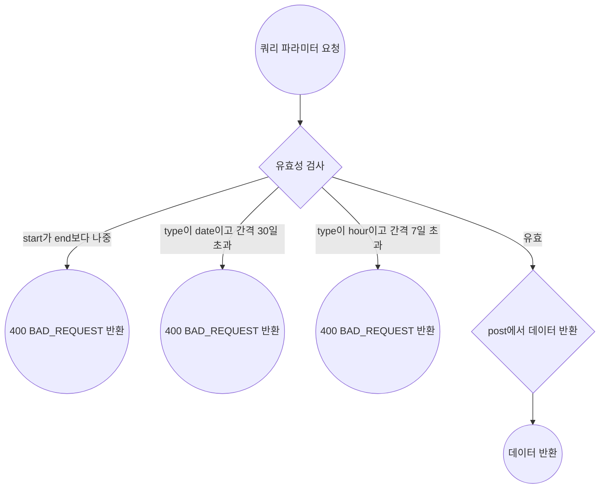

</details>

<details>
	<summary> 클래스 다이어그램 </summary>

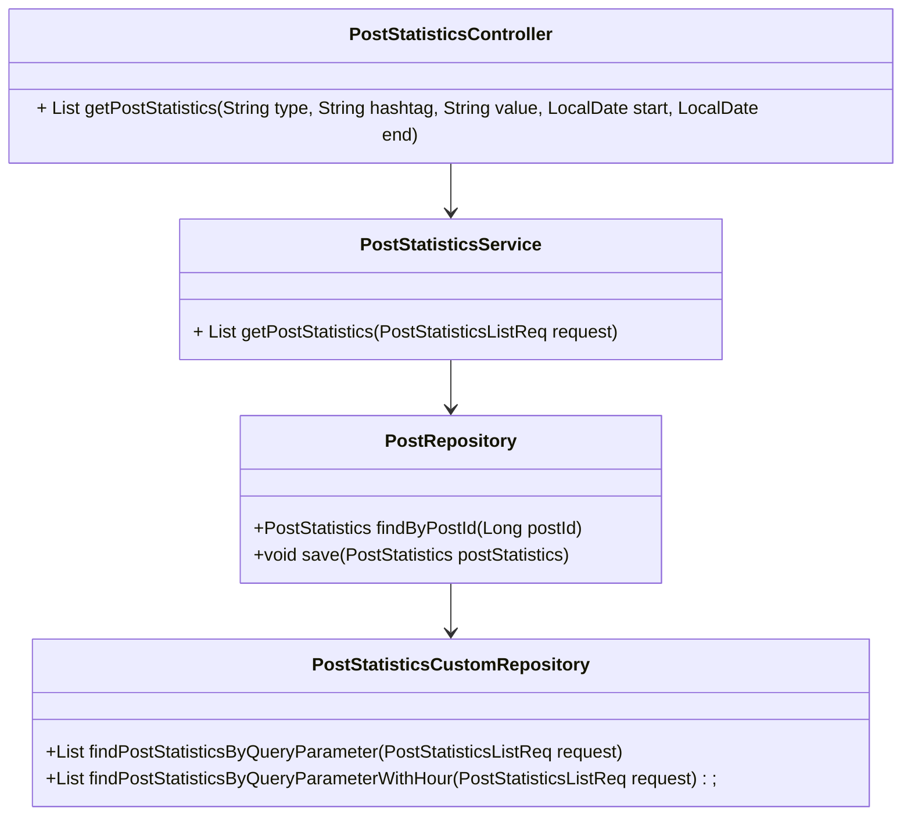

</details>


</br>

### **마일스톤 (Milestones)**

> `~ 8.22(목)`: 요구 사항 분석, 테크 스펙 작성
>
> `~ 8.23(금)`: 더미 데이터 생성. api 명세 구상
>
> `~ 8.24(토)`: `dto`, `controller` 계층 작성
>
> `~ 8.25(일)`: `service`, `repository`계층 기능 개발
>
> `~ 8.26(월)`: Rollout
</details>

## 🏗️ ERD


## 🕝 프로젝트 진행 및 이슈 관리

- Github Project 칸반보드 활용
- 각 기능별 이슈 작성 후 하위 이슈 추가

<table>
    <tr align="center">
        <td></td>
        <td></td>
</table>

## 👾 Authors

<table>
    <tr align="center">
        <td><B>주다애<B></td>
        <td><B>강경원<B></td>
        <td><B>이도은<B></td>
        <td><B>정의진<B></td>
        <td><B>조혜온<B></td>
        <td><B>이예림<B></td>
    </tr>
    <tr align="center">
            <td>
            
            <br>
            <a href="https://github.com/jooda00"><I>jooda00</I></a>
        </td>
            <td>
            
            <br>
            <a href="https://github.com/toughCircle"><I>toughCircle<I></a>
        </td>
        <td>
            
            <br>
            <a href="https://github.com/medoeun"><I>medoeun</I></a>
        </td>
        <td>
            
            <br>
            <a href="https://github.com/uijin-j"><I>uijin-j</I></a>
        </td>
        <td>
          
            <br>
            <a href="https://github.com/hye-on"><I>hye-on</I></a>
        </td>
        <td>
          
            <br>
            <a href="https://github.com/yerim123456"><I>yerim123456</I></a>
        </td>
    </tr>

</table>
