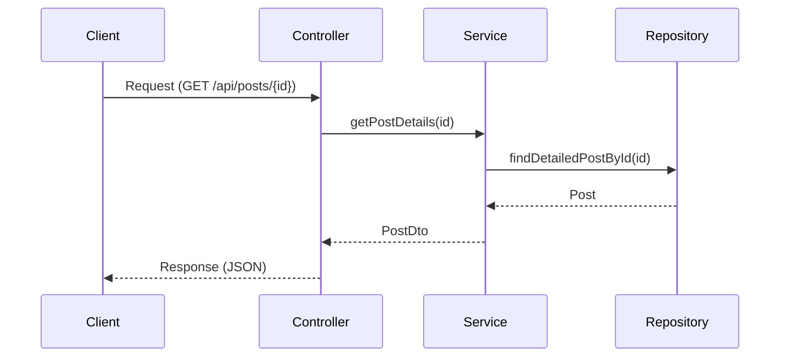

# integrated-feed-backend

소셜 미디어 통합 Feed 서비스

## 요구사항 정리 및 기술 명세서

	
 게시물 상세 조회 API

### **요약 (Summary)**

게시물 상세 조회 API는 사용자에게 특정 게시물의 상세 정보를 제공하는 기능입니다. 사용자는 이 API를 통해 게시물의 제목, 내용 및 게시물 관련 메타데이터를 조회할 수 있습니다.

### **목표 (Goals)**

- 사용자가 특정 게시물의 모든 세부 정보를 한 번의 API 호출로 가져올 수 있도록 한다.
- 사용자가 요청한 게시물이 존재하지 않는 경우, 적절한 에러 메시지를 반환한다.
- 특정 게시물의 상세 정보 반환에 성공할 경우, 해당 게시물의 view_count를 1 증가시킨다.

### **계획 (Plan)**

	
 플로우 차트

	
 시퀀스 다이어그램 

### **유닛 테스트**

- [성공] 게시물 상세 정보가 정상적으로 반환된다.
- [실패] 게시물이 없을 때 예외를 던진다.
- [성공] 조회된 게시물의 view_count가 1 증가한다.
- [실패] 잘못된 형식의 ID가 제공되면 400 Bad Request가 반환된다.

### **마일스톤 (Milestones)**

> 8월 21일 (수): 요구사항 분석  
> 8월 22일 (목): 테크 스펙 작성  
> 8월 23일 (금): 기능 구현 및 단위 테스트 작성  
> 8월 25일 (일): 테스트 수정 및 리드미 작성  

	
 게시물 “좋아요수”, “공유수” 증가 API

### **요약 (Summary)**

해당 서비스에서 `좋아요`, `공유` 버튼을 클릭할 시 각 게시물의 원래 소셜 미디어의 `좋아요` , `공유` 수를 증가시킬 수 있게 합니다.

### **목표 (Goals)**

- infra 계층에 각 외부서비스들의 클라이언트를 만듭니다.
- 본 서비스의 `좋아요`, `공유` 수를 외부 서비스에 반영시킵니다.
- 각 게시물의 `소셜미디어`에 맞게 외부서비스에서  `좋아요` 및 `공유`를 늘리는 API 엔드포인트를 구현합니다.
- 실제 API 호출을 시뮬레이션하여 외부 API와의 상호 작용을 추상화함으로써 실제 환경으로 전환할 때 변경 사항의 영향을 줄입니다.
- `event` 를 활용하여 타사 API 상호 작용 시뮬레이션을 비동기식으로 처리하여 서비스 내의 '좋아요' 및 '공유'에 대한 업데이트가 기본 애플리케이션 흐름을 차단하지 않고 효율적으로 처리되도록 합니다.

### **목표가 아닌 것 (Non-Goals)**

- 실제 외부 서비스의 API를 직접 호출하는 기능 개발
- 처리 중에 실제 외부 서비스의 응답을 동기적으로 기다리는 기능 개발
- 살제 외부 서비스의 응답을 기반으로 내부 서비스 로직을 처리하는 기능
- `좋아요` 수와 `공유` 수를 저장했다가 한번에 반영하는 것

### **계획 (Plan)**

	
 플로우 차트

	
 클래스 다이어그램 

	
 시퀀스 다이어그램 

# **마일스톤 (Milestones)**

> `~ 8.22(목)`:  controller 계층 구현  
`~ 8.23(금)`:  infra 계층의 adapter,client 구현  
`~ 8.24(토)`: service 구현, 단위 테스트 작성  
`~ 8.25(일)`: Rollout
>

